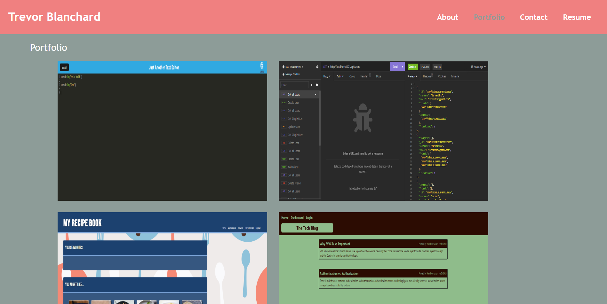
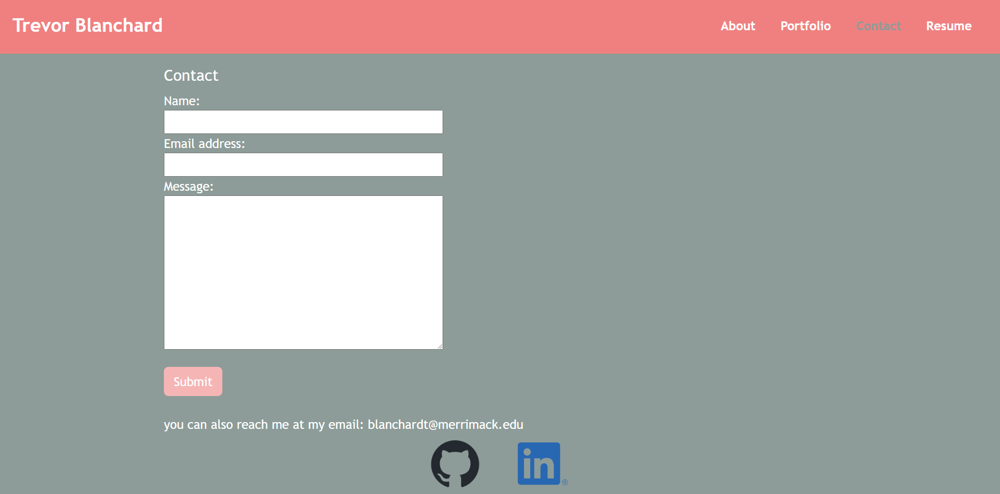
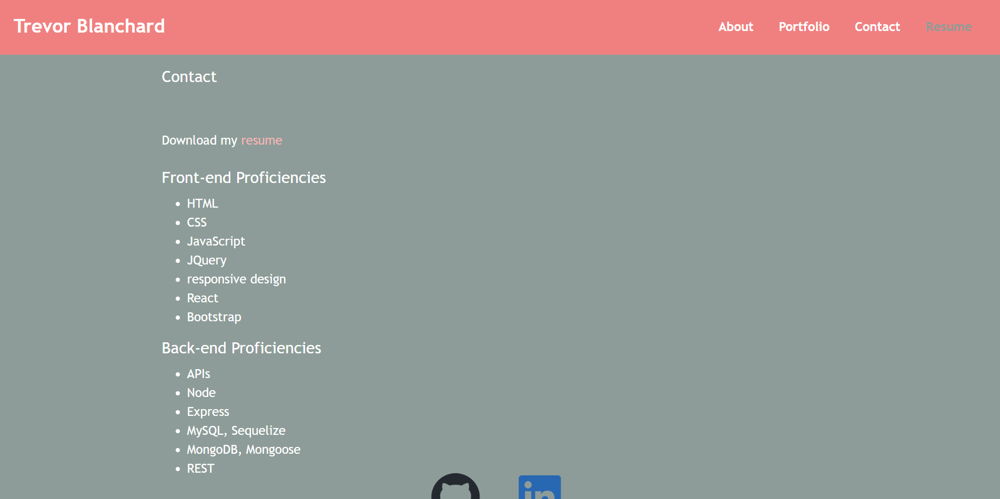

# trevors-react-portfolio
   

## Description   
My personal Portfolio created using React.js   

## Table of Contents  
* [Installation](#installation)  
* [Usage](#usage)  
* [Credits](#credits)  
* [License](#license)  
* [Contributing](#contributing) 
* [Questions](#questions)

## Installation  
To install necessary dependencies, run the following command:  

```  
npm install  
```  

## Usage  
In order to run the code, type ```npm run start``` in the base route of the directory.  This is my second portfolio.  There is an about me (or home), portfolio, contact, and a resume page.  The about me page gives some more info about me and has my picture on it.  The portfolio page contains links to my previous projects and the git hub repos for them.  The contact page provides a form to contact me by (not fully working yet) and contains my email address to guarantee you can get ahold of me through email.  The resume provides a link to download my resume and some information on what I have worked with recently.      
Home:   
     
Portfolio:  
    
Contact:  
    
Resume:  
       


## Credits  
Created by: Trevor Blanchard  
Link to repo: https://github.com/blanchardt/trevors-react-portfolio   
Link to live site:   

### Resume.jsx  

line 10:   
went to https://stackoverflow.com/questions/69289110/how-to-create-a-download-link-pdf-in-react to learn how to set up a link to download a pdf.   
Simon, et al. “Image Height Same as Width.” Stack Overflow, 20 July 2018,    
&nbsp;&nbsp;&nbsp;&nbsp;&nbsp;stackoverflow.com/questions/51447317/image-height-same-as-width.     

### App.css

line 94-98:  
went to https://stackoverflow.com/questions/51447317/image-height-same-as-width to figure out how to have the height and width be the same.   
Tanzeel, and silencedogood. “How to Create a Download Link (PDF) in React.” Stack Overflow, 22 Sept. 2021,   
&nbsp;&nbsp;&nbsp;&nbsp;&nbsp;stackoverflow.com/questions/69289110/how-to-create-a-download-link-pdf-in-react.   


## License  
This project is licensed under the MIT license.  

## Questions  
If you have any questions about the repo, open an issue or contact me directly at blanchardt@merrimack.edu.  You can find more of my work at [blanchardt](https://github.com/blanchardt/).  